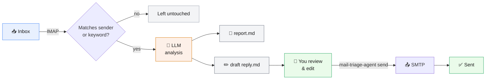

# Mail Triage Agent

[](https://github.com/RutkayAzizAksu/mail-triage-agent/actions/workflows/ci.yml)
[](LICENSE)
[](https://www.python.org/downloads/)
[](https://www.anthropic.com/claude)

A small, self-hosted agent that watches your inbox for emails from senders or
containing keywords **you** choose, analyzes each match with an LLM, and
writes a report + a draft reply for you to review, edit, and send. Nothing is
sent automatically — every reply goes out only when you run `send` yourself.

Works with **any standard IMAP/SMTP mail provider** — Gmail, Outlook /
Microsoft 365, Yahoo, iCloud, Zoho, or most corporate mail servers — and lets
you **bring your own AI provider and API key**: Anthropic Claude, OpenAI,
Google Gemini (free tier available), or literally any other OpenAI-compatible
API (Groq, OpenRouter, a local Ollama server, ...). It's a plain Python
script you run on your own machine; your mail and API keys never leave your
computer except for the two connections it makes on your behalf: your mail
server (IMAP/SMTP) and your chosen AI provider's API (to analyze the email
text).

## Features

- Filter by sender or keyword, so only the mail you actually care about gets analyzed.
- Pick your own AI provider in `.env`: Anthropic Claude, OpenAI, Google Gemini
  (has a free tier), or any other OpenAI-compatible API — Groq, OpenRouter,
  a local Ollama server, whatever you'd rather use.
- Before it drafts anything, it checks the sender: SPF/DKIM/DMARC authentication,
  a Reply-To that doesn't match the From address, a display name impersonating
  a known brand. The verdict goes in the report and feeds into the draft.
- Analysis gives you a summary, category, priority, and suggested action per email.
- Replies are plain text files you read and edit yourself. Nothing goes out
  until you run `send`.
- Standard IMAP/SMTP under the hood, so it works with Gmail, Outlook, Yahoo,
  iCloud, and most corporate mail servers.
- Re-running `check` (from cron, say) won't duplicate drafts — it keeps a
  local state file of what it's already processed.
- Credentials stay in your own `.env`. Nothing leaves your machine except
  calls to your mail server and whichever AI provider you picked.
- Covered by unit tests, a mocked end-to-end run, and a real IMAP/SMTP
  round-trip against a disposable local mail server — all run in CI on
  Python 3.9–3.13.

## Table of contents

- [How it works](#how-it-works)
- [Requirements](#requirements)
- [Setup](#setup)
- [Usage](#usage)
- [Cost & privacy](#cost--privacy)
- [Troubleshooting](#troubleshooting)
- [Development](#development)
- [Contributing](#contributing)
- [License](#license)

## How it works



1. `check` connects to your inbox over IMAP and looks at recent messages.
2. Each message is matched against `WATCH_SENDERS` / `WATCH_KEYWORDS` from
   your config. Non-matching mail is skipped and left untouched.
3. **Before analyzing anything**, the sender is put through a deterministic
   trust check: SPF/DKIM/DMARC authentication (read from the
   `Authentication-Results` header your mail server already attaches),
   Reply-To vs. From domain mismatches, and display-name brand-impersonation
   heuristics (e.g. "PayPal Support" from a domain that isn't paypal.com).
4. Matching mail — plus the trust-check verdict — is sent to your configured
   AI provider, which returns a summary, category, priority, suggested
   action, and a draft reply that takes the trust verdict into account.
5. Two files are written to `data/drafts/`:
   - `<id>.report.md` — the analysis, **including the sender trust check**,
     for you to read.
   - `<id>.reply.md` — the editable draft reply (plain text with a small
     metadata header). Open it in any text editor and change anything you
     want.
6. `send <file>` sends the (possibly edited) draft over SMTP, threaded as a
   reply to the original message.
7. Already-processed messages are remembered in `data/state.json`, so running
   `check` again (e.g. from a cron job) never creates duplicate drafts.

The sender trust check is a heuristic, not a guarantee — it reads whatever
your mail server already tells you (most providers, including Gmail and
Outlook, attach `Authentication-Results`) rather than performing its own DNS
lookups. Treat a ⚠️ as "look closer before trusting this," not as proof of a
scam, and treat a ✅ the same way we treated it for the real "Link
<notifications@link.com>" example this project's README was informed by:
good signal, not a substitute for judgment.

Nothing is ever sent without you explicitly running `send`.

## Requirements

- Python 3.9+
- An API key from **one** AI provider (pay-as-you-go, or free for some) —
  you are billed directly by that provider only for the emails you actually
  analyze; the project itself is free and open source:
  - [Anthropic API key](https://console.anthropic.com/) (default), or
  - [OpenAI API key](https://platform.openai.com/), or
  - [Google Gemini API key](https://aistudio.google.com/apikey) (has a free
    tier), or
  - any OpenAI-compatible API of your choice — [Groq](https://console.groq.com/keys)
    (free tier), [OpenRouter](https://openrouter.ai/keys) (many free models),
    or a fully free local [Ollama](https://ollama.com/) server
- IMAP/SMTP access to your mailbox, usually via an **app-specific password**
  (see the provider table below)

## Setup

```bash
git clone https://github.com/RutkayAzizAksu/mail-triage-agent.git
cd mail-triage-agent

python3 -m venv .venv
source .venv/bin/activate      # Windows: .venv\Scripts\activate

pip install -r requirements.txt

cp .env.example .env
# now edit .env with your own values (see below)
```

### Filling in `.env`

Open `.env` and set:

- `IMAP_HOST` / `IMAP_PORT` / `IMAP_USER` / `IMAP_PASSWORD` — your mailbox.
- `SMTP_HOST` / `SMTP_PORT` — your outgoing server (`SMTP_USER`/`SMTP_PASSWORD`
  default to your IMAP credentials if left blank).
- `LLM_PROVIDER` — `anthropic` (default), `openai`, `gemini`, or `custom`.
  Only the matching key(s) below are required:
  - `anthropic` → `ANTHROPIC_API_KEY` (+ optional `ANTHROPIC_MODEL`, default
    `claude-sonnet-5`)
  - `openai` → `OPENAI_API_KEY` (+ optional `OPENAI_MODEL`, default
    `gpt-4o-mini`)
  - `gemini` → `GEMINI_API_KEY` (+ optional `GEMINI_MODEL`, default
    `gemini-2.5-flash`) — has a free tier
  - `custom` → `CUSTOM_API_KEY` + `CUSTOM_BASE_URL` + `CUSTOM_MODEL` — points
    at **any** OpenAI-compatible chat-completions endpoint: Groq (free tier),
    OpenRouter (many free models), a local Ollama server (fully free, no
    internet required), Together, DeepSeek, etc. See `.env.example` for
    ready-to-use base URLs.
- `WATCH_SENDERS` — comma-separated email addresses/domains to watch for,
  e.g. `boss@example.com,billing@vendor.com`.
- `WATCH_KEYWORDS` — comma-separated words to watch for in the subject/body,
  e.g. `urgent,invoice,contract`.

You need at least one of `WATCH_SENDERS` or `WATCH_KEYWORDS` set — otherwise
the agent has nothing to filter on and refuses to start (with a clear error,
not a crash).

### Provider settings

Most providers block plain-password IMAP/SMTP login for third-party apps by
default — you need to generate an **app-specific password** first.

| Provider | IMAP host | SMTP host | App password |
|---|---|---|---|
| Gmail / Google Workspace | `imap.gmail.com:993` | `smtp.gmail.com:587` | [Generate one](https://myaccount.google.com/apppasswords) (requires 2-Step Verification enabled) |
| Outlook / Microsoft 365 | `outlook.office365.com:993` | `smtp.office365.com:587` | [Generate one](https://account.microsoft.com/security) under Security → Advanced security options |
| Yahoo Mail | `imap.mail.yahoo.com:993` | `smtp.mail.yahoo.com:587` | Account Info → Account Security → Generate app password |
| iCloud Mail | `imap.mail.me.com:993` | `smtp.mail.me.com:587` | [appleid.apple.com](https://appleid.apple.com) → Sign-In and Security → App-Specific Passwords |
| Other / corporate | ask your mail admin | ask your mail admin | ask your mail admin |

If your provider uses implicit SSL on the SMTP port (typically port 465
instead of 587 with STARTTLS), set `SMTP_USE_SSL=true`.

## Usage

```bash
# 1. Scan the inbox for new matching mail, analyze it, write drafts
python -m mail_triage_agent check

# 2. See what drafts are waiting for you
python -m mail_triage_agent list

# 3. Open data/drafts/<id>.reply.md in your editor, edit the reply text
#    (the YAML header at the top — to/subject/etc. — can be edited too)

# 4. Send it once you're happy with it
python -m mail_triage_agent send <id>-your-subject.reply.md
```

If you installed the package (`pip install -e .` or via `pyproject.toml`),
the `mail-triage-agent` command is also available directly, e.g.
`mail-triage-agent check`.

### Running on a schedule

The agent is a one-shot script — `check` does a single pass and exits — so
you drive it with your OS's scheduler.

**macOS / Linux (cron)** — run every 10 minutes:

```cron
*/10 * * * * cd /path/to/mail-triage-agent && .venv/bin/python -m mail_triage_agent check >> data/cron.log 2>&1
```

**Windows (Task Scheduler)** — create a Basic Task, trigger "Repeat every 10
minutes", action:

```
Program: C:\path\to\mail-triage-agent\.venv\Scripts\python.exe
Arguments: -m mail_triage_agent check
Start in: C:\path\to\mail-triage-agent
```

## Cost & privacy

- The project itself is free — there is no subscription or hidden fee.
- Each `check` run costs a small amount of API usage with whichever provider
  you configured, billed directly to your own API key, only for the emails
  that actually match your filters — free if you're using Gemini's free
  tier, Groq, or a local Ollama model.
- Your mail credentials and API key live only in your local `.env` file
  (already git-ignored) — they are never uploaded anywhere by this project.
- Email content is sent to your configured AI provider's API for analysis
  only for messages that match your `WATCH_SENDERS`/`WATCH_KEYWORDS` filters
  — everything else is left untouched on the mail server.

## Troubleshooting

- **"Could not connect/login to ... "** — almost always means you used your
  normal account password instead of an app-specific password, or 2FA isn't
  enabled (required by Gmail/Outlook to issue app passwords).
- **"Set at least one of WATCH_SENDERS or WATCH_KEYWORDS"** — your `.env` has
  neither filter set; add at least one.
- **"... did not return valid JSON"** — transient model hiccup; just run
  `check` again, the unprocessed message will be retried.
- **"Unknown LLM_PROVIDER"** — `LLM_PROVIDER` in your `.env` must be exactly
  `anthropic`, `openai`, `gemini`, or `custom`.
- **Trust check always shows `unknown` for SPF/DKIM/DMARC** — your mail
  server isn't attaching an `Authentication-Results` header (some smaller
  or self-hosted servers don't). The rest of the trust check (Reply-To
  mismatch, brand impersonation) still works.
- **No drafts appear** — check that the matching email is actually unread
  (the default `check` only scans unseen mail — pass `--include-seen` to scan
  read mail too).

## Development

```bash
pip install -r requirements.txt
python -m py_compile mail_triage_agent/*.py tests/*.py
python -m unittest discover -s tests -v
```

CI runs the same checks on every push across Python 3.9–3.13 — see
[.github/workflows/ci.yml](.github/workflows/ci.yml).

## Contributing

Contributions are welcome — see [CONTRIBUTING.md](CONTRIBUTING.md) for the
workflow, and [CHANGELOG.md](CHANGELOG.md) for release history. Please
review [SECURITY.md](SECURITY.md) before reporting anything credential- or
privacy-related, and use a private report instead of a public issue for
those.

## License

MIT — see [LICENSE](LICENSE). You're free to use, modify, and redistribute
this project; keep the copyright notice.
